# GOMITO ARTIFICIALE

## 🇮🇹 ITALIANO

### DESCRIZIONE DEL PROGETTO

Questo progetto, sviluppato per il corso di "Meccanica Applicata alle Macchine" del Politecnico di Milano, analizza e modella un sistema meccanico di gomito artificiale per amputati, azionato da un motore elettrico brushless. Il sistema replica il movimento di flesso-estensione del gomito tramite un meccanismo composto da una vite a ricircolo di sfere e un sistema a glifo oscillante, riducendo attriti, rumorosità e peso complessivo dell'articolazione. Il progetto comprende analisi dettagliate di cinematica, dinamica, azionamento del motore e risposta vibrazionale del sistema.

### CONTENUTI DEL PROGETTO

### CONTENUTI DEL PROGETTO

- **Schema cinematico** comprensivo di tre parti principali: il glifo (meccanismo con asta e corsoio), il quadrilatero articolato (bilancieri e biella) e l'avambraccio (corpo rigido con baricentro e massa concentrata).

  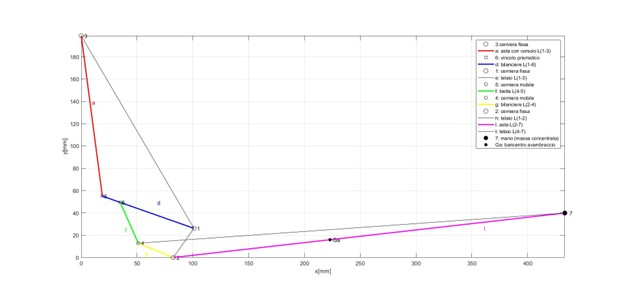

- **Analisi cinematica**, con calcoli di velocità, accelerazioni lineari e angolari dei punti principali del sistema mediante MATLAB.

  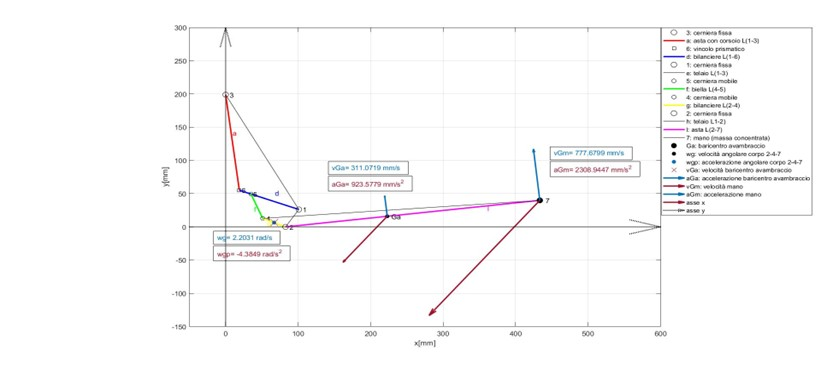

- **Legge di moto**, descrizione e simulazione del movimento della protesi nel tempo.

  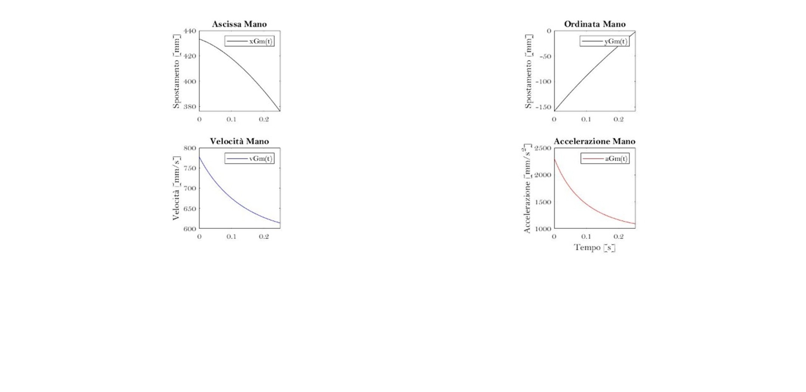

- **Analisi dinamica**, determinazione delle coppie motrici e forze necessarie tramite equilibri dinamici.

  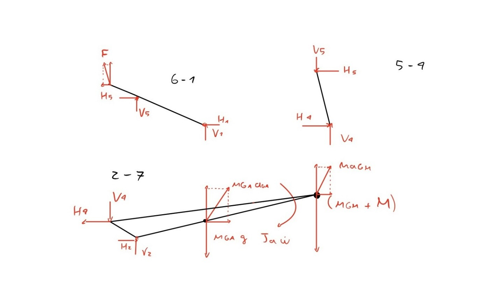

- **Azionamento motore**, calcolo della coppia ideale, potenza assorbita e capacità massima di sollevamento.

  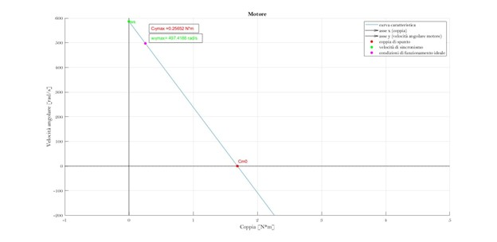

- **Studio delle vibrazioni**, inclusa la definizione e simulazione della risposta dinamica del sistema a forzanti esterne armoniche.

  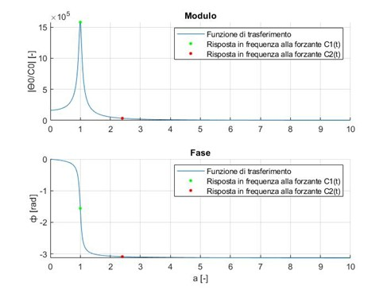 
  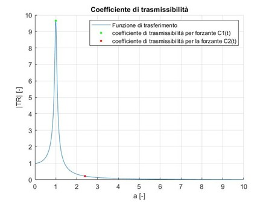 
  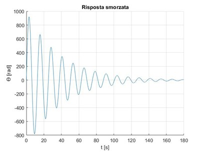 
  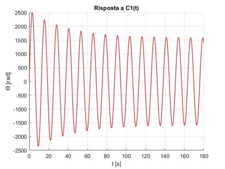 
  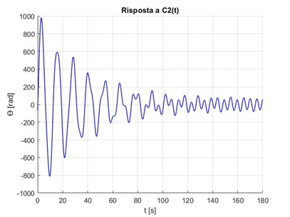 
  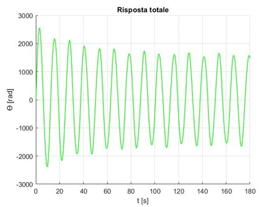

  

### FILE PRINCIPALI

- `main.m`: Script MATLAB completo che implementa tutte le analisi sopracitate.
- `Report-ITA.pdf`: Relazione tecnica contenente la procedura completa, immagini e risultati dell'elaborato che implementa tutte le analisi sopracitate.

### STRUMENTI

- MATLAB per simulazioni numeriche e analisi.

### RISULTATI CHIAVE

- Coppia motrice ideale: **0.25652 N·m**
- Massa sollevabile dal paziente: **15.7167 kg**
- Frequenza propria del sistema: **0.079615 Hz**
- Range ideale frequenze elettrostimolazione: **≥ 0.16 Hz**

### AUTORE

Francesco Santambrogio  
Meccanica Applicata alle Macchine – Politecnico di Milano, 2021

---

## 🇬🇧 ENGLISH

### PROJECT DESCRIPTION

This project, developed as part of the "Applied Mechanics" course at Politecnico di Milano, analyzes and models an artificial elbow system for amputees powered by a brushless DC motor. The system replicates elbow flexion-extension through a mechanism consisting of a ball-screw transmission and oscillating glyph, minimizing friction, noise, and joint weight. The project includes detailed analyses of kinematics, dynamics, motor actuation, and vibration response.

### PROJECT CONTENTS

### PROJECT CONTENTS

- **Kinematic scheme**, including three main components: the glyph (mechanism with rod and slider), the articulated quadrilateral (rockers and connecting rod), and the forearm (rigid body with center of mass and concentrated mass).

  

- **Kinematic analysis**, including linear and angular velocities and accelerations calculations of critical points using MATLAB.

  

- **Motion law**, describing and simulating the prosthesis movement over time.

  

- **Dynamic analysis**, determining required driving torque and equilibrium forces through dynamic equilibrium equations.

  

- **Motor actuation analysis**, calculating ideal torque, absorbed power, and maximum lifting capacity.

  

- **Vibration study**, defining and simulating the dynamic system response to external harmonic forces.

   
   
   
   
   
  

### MAIN FILES

- `main.m`: Complete MATLAB script implementing all described analyses.
- `Report-ITA.pdf`: Technical report including full procedure, images, and results of the study implementing all the described analyses.

### TOOLS

- MATLAB for numerical simulations and analyses.

### KEY RESULTS

- Ideal driving torque: **0.25652 N·m**
- Mass that can be lifted by the patient: **15.7167 kg**
- Natural frequency of the system: **0.079615 Hz**
- Ideal frequency range for electrostimulation: **≥ 0.16 Hz**

### AUTHOR

Francesco Santambrogio  
Applied Mechanics – Politecnico di Milano, 2021
